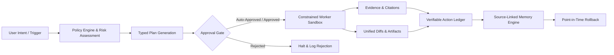

# Proofbound 🛡️

> **Evidence-First Personal Operations Agent with Verifiable Action Ledger & Source-Linked Memory**

[](https://opensource.org/licenses/MIT)
[](https://www.python.org/downloads/)
[](https://fastapi.tiangolo.com)
[](#10-task-verification-benchmark)

---

## 🌟 Executive Overview

**Proofbound** is a local-first personal operations agent platform designed around a core principle: **agents should not just execute actions—they must prove them, explain their risks at policy boundaries, and maintain a reversible, source-linked memory.**

While platforms like Hermes Agent or QwenPaw focus broadly on multi-channel messaging and general-purpose chat loops, **Proofbound** delivers a disciplined operational wedge:

$$\text{Intent} \longrightarrow \text{Risk Classification} \longrightarrow \text{Typed Plan} \longrightarrow \text{Approval Gate} \longrightarrow \text{Constrained Worker} \longrightarrow \text{Evidence Ledger} \longrightarrow \text{Reversible Memory}$$



---

## 🔑 Key Pillars & Differentiators

| Capability | Hermes / Typical Agents | Proofbound Advantage |
| :--- | :--- | :--- |
| **Execution Safety** | Broad terminal execution | **Policy boundaries, risk tiers (LOW/MED/HIGH/CRITICAL), scoped capability tokens** |
| **Evidence & Citations** | Unlinked free-text responses | **Cryptographically hashed claim-source citations with confidence scoring** |
| **Memory Architecture** | Opaque long-term vector store | **Inspectable, source-linked, editable, and point-in-time reversible memory bank** |
| **Auditability** | Raw unstructured chat transcript | **Deterministic SQLite action ledger with full event replay and JSON/Markdown export** |
| **Operation Portability** | Immediate side effects | **Reversible staging (draft emails, staged git commits, unified diffs)** |

---

## 📐 Canonical Contract: `ActionRun`

Every operation in Proofbound is governed by the typed `ActionRun` lifecycle:

```python
ActionRun {
    id: str,
    user_id: str,
    intent: str,
    plan_steps: list[PlanStep],
    requested_scopes: list[str],
    risk_level: RiskLevel,            # LOW | MEDIUM | HIGH | CRITICAL
    approval_state: ApprovalState,    # PENDING | APPROVED | REJECTED | AUTO_APPROVED
    worker: str,
    inputs_hash: str,                 # SHA-256 integrity hash
    events: list[ActionEvent],        # Deterministic timeline
    artifacts: list[Artifact],        # Unified diffs, drafts, reports
    citations: list[Citation],        # Verified source links
    memory_updates: list[Proposal],   # Proposed facts with rollback state
    started_at: datetime,
    completed_at: datetime | None,
    rollback_or_recovery: RollbackInfo | None
}
```

---

## 🚀 Quickstart Guide

### 1. Installation

```bash
# Clone repository
git clone https://github.com/your-username/proofbound.git
cd proofbound

# Install in virtualenv
pip install -e .
```

### 2. Launch the Web Dashboard

```bash
proofbound serve --port 8000
```
Open **`http://localhost:8000`** in your browser to access the glassmorphic Operations Console, Live Approval Modals, Memory Bank, and Ledger Replay Engine.

---

## 💻 CLI Commands

```bash
# Execute an intent directly in the terminal
proofbound run "Research evidence-based agent architectures"

# Auto-approve risk gates
proofbound run "Draft ops summary email" --yes

# Inspect verifiable action audit logs
proofbound audit list
proofbound audit show --run-id <RUN_ID>
proofbound audit replay --run-id <RUN_ID>

# Manage source-linked memory and rollback
proofbound memory list
proofbound memory rollback --fact-id <FACT_ID>

# Run the 10-Task Verification Benchmark
proofbound benchmark
```

---

## ⚡ 10-Task Verification Benchmark

Proofbound ships with a built-in verification harness implementing all 10 benchmarks from the specification:

1. **Multi-Source Research**: Automated citation extraction and validation.
2. **Domain-Restricted Web Extraction**: Strict domain allowlist enforcement.
3. **Sandboxed Workspace Search**: Boundary-checked filesystem exploration.
4. **Reversible File Patch**: Unified diff generation and automated rollback.
5. **Reversible Draft Creation**: Staged email draft composition.
6. **Destructive Command Gate**: Interception and blocking of high-risk shell calls.
7. **Prompt Injection Defense**: Trapping of unauthorized override attempts.
8. **Memory Provenance Linking**: Provenance-linked fact proposal and acceptance.
9. **Memory Snapshot Rollback**: Reverting memory fact to prior revision.
10. **Deterministic Replay**: 100% event log match verification.

Run the benchmark suite:
```bash
python -m proofbound.benchmark.suite
```

---

## 🐳 Docker Deployment

```bash
docker-compose up --build -d
```

---

## 📄 License

MIT License. See [LICENSE](LICENSE) for details.
